# How Responder Works

This guide follows one message from admission through Slack delivery and explains where state,
memory, authority, retries, and cleanup live. It describes the current single-host implementation,
not a future multi-tenant design.

Conversational responses follow the operator's current Slack location. Top-level conversation stays
in the channel, thread conversation stays in that thread, and explicit requests to move are
host-parsed before model execution. Multi-step configuration sessions persist every message root
they own so moving between channel and thread does not lose state or admit unrelated replies.

## 1. System map and authority boundaries

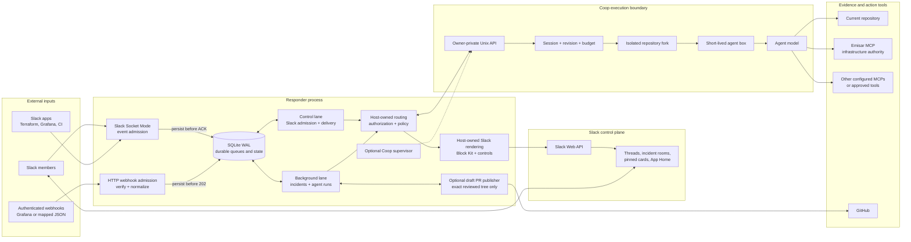

Authority is deliberately split:

| Boundary | Owner | Responder cannot bypass it |
| --- | --- | --- |
| Slack identity, event admission, conversation routing, durable queues | Responder | Slack membership and configured operator checks |
| Repository allowlist, fork, agent target, box, revision, turn budget | Coop | Coop policy and revision conflicts |
| Live infrastructure identity, action schemas, policy, approval, execution, audit | Emisar | Emisar authorization and approval decisions |
| Draft branch publication | Responder publisher | Exact Coop-reviewed tree, lease-protected branch, draft PR only |
| Merge, signing, deployment | External human-controlled workflow | No Responder operation exists for these actions |

Slack and webhook secrets stay in Responder. The Emisar key is projected into the short-lived Coop
box through Coop's private configuration; it is not sent in prompts. Slack never receives Coop's
filesystem or terminal protocol.

## 2. Slack event admission and routing

Socket Mode handlers do minimal synchronous work: validate the workspace and event shape, persist a
deduplicated `slack_inputs` row, and only then acknowledge Slack. The worker makes the expensive
decision later. A persistence or policy-resolution failure before that point is not acknowledged,
so Slack can redeliver the envelope instead of Responder silently losing it.

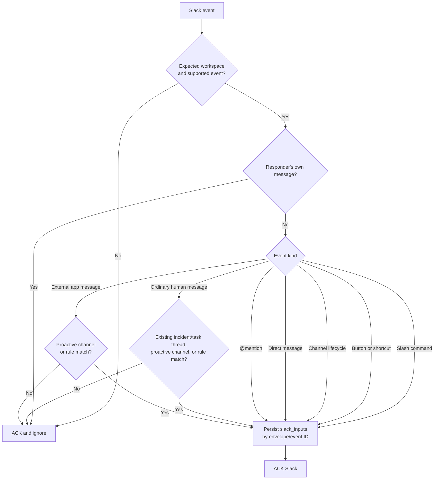

Separately, a bounded scheduler lists Slack conversations every ten seconds. It stores only channel
membership state, detects absent-to-present transitions, and persists a synthetic `channel_joined`
input. This avoids relying on `member_joined_channel`, which Slack cannot deliver for the bot's own
first join. The transition and input are durable, so restarts cannot duplicate or lose onboarding.

After acknowledgement, the durable worker applies the more expensive authorization and conversation
routing:

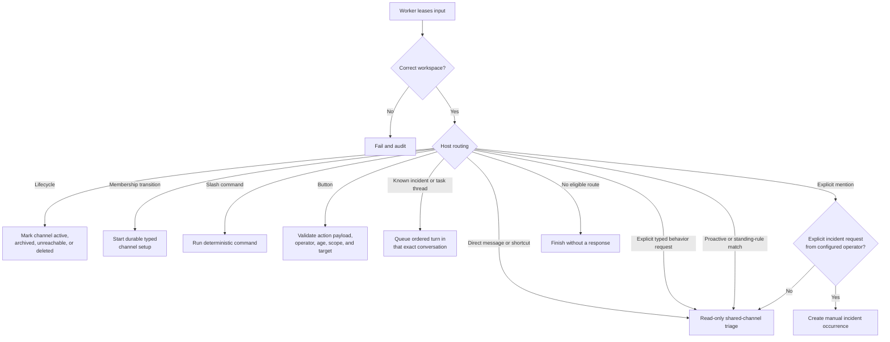

Important routing behavior:

- A direct message or **Investigate message** shortcut always enters read-only triage.
- When Slack reports that the bot joined a channel, Responder opens one durable setup conversation.
  Operator answers advance a host-owned typed draft; a confirmation button bound to the stored
  session ID is required before settings change.
- Supported conversational controls are normalized into the same command handlers as
  `/responder`. Read results are threaded publicly; slash results remain ephemeral.
- An explicit `@mention` always summons read-only triage in any channel where Emisar is a member.
  Proactive participation, shadow evaluation, and app-alert policy remain channel-configured.
- A successfully delivered triage reply opens a 30-minute continuation window at that channel or
  thread location. Human follow-ups are admitted without another mention; a reply that starts a
  thread from Emisar's top-level answer is treated as the same exchange.
- Messages already bound to an incident room or engineering-task thread stay in that conversation.
- Broad proactivity and deterministic standing rules are separate. A rule can admit its matching
  event while general proactive triage is off.
- A typed standing-rule match starts a model evaluation but does not force speech. The model may
  ignore an intermediate or duplicate event, react, or reply when the message and read-only tools
  provide a useful result. Later lifecycle updates are evaluated fresh. Terraform findings still
  require the exact plan or a read-only lookup of that run; commit history is context, not a
  substitute.
- Human senders must be active full workspace members. Incident steering and confirmations require
  a configured operator.
- Responder ignores its own posts, foreign-workspace events, unsupported subtypes, guests, and
  Slack Connect users that do not satisfy the membership boundary.

## 3. One complete shared-channel triage turn

This is the path used for direct messages, message shortcuts, summon mentions, proactive channel
messages, and standing-rule matches.

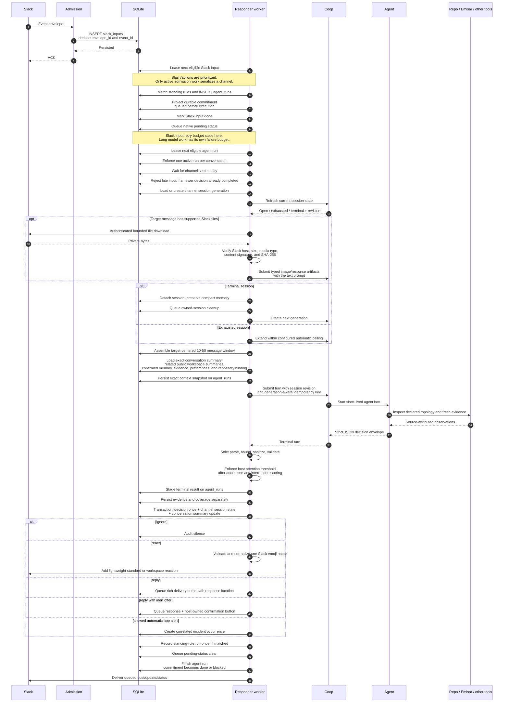

Attachment bytes are deliberately turn-scoped. Responder stores Slack-owned file metadata so a
durable retry can repeat the authenticated download, but it never serializes a private URL or file
body into the prompt, compact conversation memory, evidence ledger, or Slack response. Coop stores
the bounded payload only until the turn completes, fails, or is cancelled, then deletes it. When a
triage answer offers an engineering task, accepting that offer queues the initial writable turn
against the original Slack input so the same screenshot or document reaches the isolated task fork.

The model does not return arbitrary Slack blocks. It returns a strict decision envelope containing
prose, evidence, coverage, compact memory, and at most one inert offer. Responder owns buttons,
confirmation dialogs, mentions, approval links, limits, and persistence.

For shared-channel work, accepted decisions are:

| Decision | Effect |
| --- | --- |
| `ignore` | Audit the decision and post nothing |
| `reply` | Post a bounded rich response where a human is speaking; keep app alerts and standing rules in the source thread |
| Reply plus incident offer | Show **Open incident room**; create nothing until confirmed |
| Reply plus engineering-task offer | Show **Start engineering task**; create no writable fork until confirmed |
| Reply plus memory/preference/rule offer | Show a typed confirmation; save nothing until confirmed |
| Automatic incident | Allowed for a credible unresolved monitoring-app alert, not an ordinary human health question |

## 4. Memory, context, evidence, preferences, and rules

Responder does not have one undifferentiated memory. It has separate stores because conversation
continuity, factual hints, current evidence, and executable behavior require different trust and
retention rules.

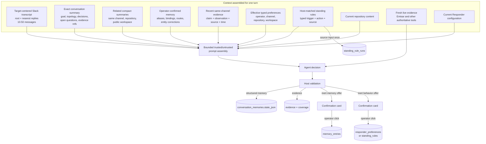

### Memory layers

| Layer | Stored in | Writer | Purpose | Trust and lifetime |
| --- | --- | --- | --- | --- |
| Exact Slack context | Slack history plus `slack_inputs`, then snapshotted in `agent_runs.context_json` | Context assembler | Preserve the thread root and messages nearest the target while avoiding unrelated threads | Raw event context only; 10-50 messages and operational-data retention |
| Compact conversation situation | `conversation_memories.state_json` | Agent result after host validation | Carry purpose, situation, goal, active topics, topology, decisions, open loops, unresolved questions, and evidence references across turns | Continuity, not current-health proof; 90-day default retention |
| Related workspace situations | Recent `conversation_memories` selected at prompt assembly | Host-owned context selection | Recall overlapping work from the same channel, repository, and public workspace channels | Bounded to eight summaries; private channels never cross channel boundaries |
| Channel session state | `channel_memories.state_json` | Agent result after host validation | Preserve a fallback while the per-channel Coop session rotates | Session continuity, not the organizational memory boundary |
| Evidence ledger | `evidence`, `coverage`, `timeline_events` | Host after strict agent-report parsing | Preserve source-attributed observations independently of prose | Same-channel recall; time and source remain visible |
| Confirmed operational memory | `memory_entries` | Configured operator click | Durable alias, repository binding, evidence route, or entity correction | Untrusted hint with scope, source, expiry, and caps |
| Work commitments | `commitments` projected from `agent_runs` | Host when it accepts model-backed work | Show what Emisar owes, current progress, and the next operator action | Execution state, not prompt memory or evidence |
| Preferences | `responder_preferences` | Configured operator click | Typed investigation depth or response detail | Closed catalog; precedence and expiry are host-owned |
| Standing rules | `standing_rules` | Configured operator click | Typed channel subscription such as Terraform-plan review | Host matches trigger deterministically; read-only |
| Rule executions | `standing_rule_runs` | Host | Prevent the same rule/source event from running twice | Idempotency record, later pruned |
| Incident intelligence | Incident, evidence, coverage, timeline, proposals, approvals | Webhook, host, agent, operators | Coordinate one incident or engineering task | Bound to that work occurrence |

### Evidence precedence

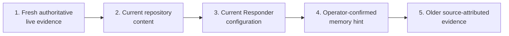

Higher items resolve conflicts with lower items. Memory never proves current health, carries a
credential, grants approval, or authorizes a mutation. The model cannot write confirmed memory,
preferences, or rules directly.

### Typed behavior setup and execution

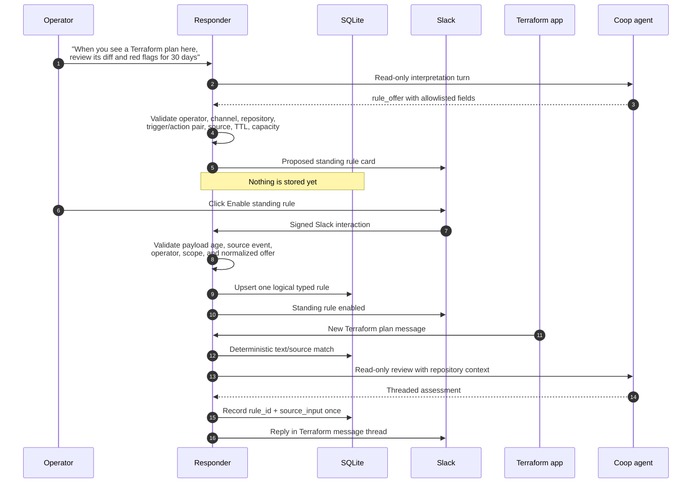

Arbitrary remembered prose never becomes an executable prompt. Only the closed host catalog can be
saved:

- preferences: `health_check_depth` and `response_detail`;
- triggers: `terraform_plan`, `deployment`, and `operational_alert`;
- actions: `review_terraform_plan`, `verify_deployment`, and `triage_alert`;
- sources: `human`, `app`, or `any`.

## 5. Shared triage, incident rooms, and engineering tasks

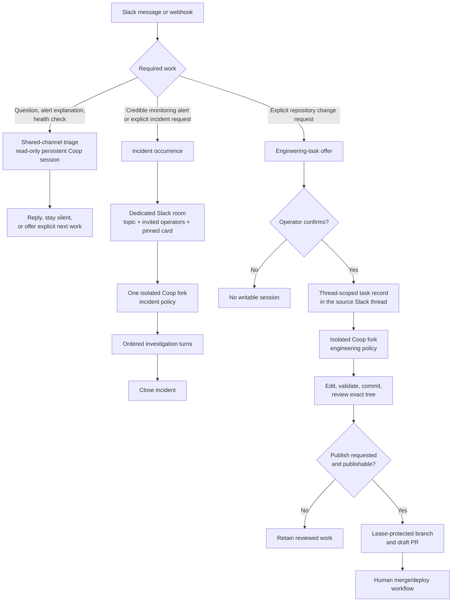

An engineering task uses the same durable work model as incident work but stays attached to the
source thread. Dedicated rooms are reserved for incidents. A shared-channel triage session cannot
edit files; the operator confirmation creates the separate writable task session.

## 6. Emisar tools and approval handoff

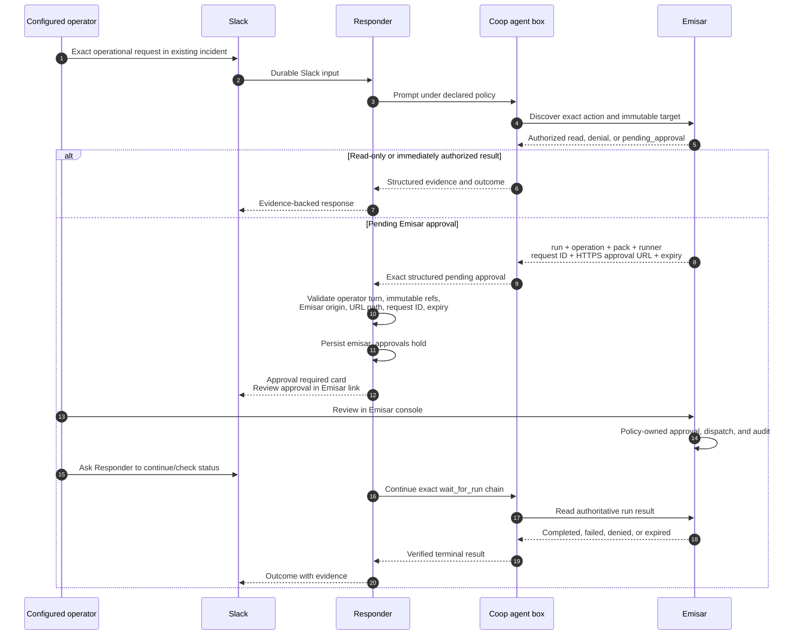

The Slack link never approves an action. Approval authorizes Emisar to dispatch; it is not proof of
successful execution. A later read of the exact run establishes the outcome.

## 7. Durability, ordering, retries, and garbage collection

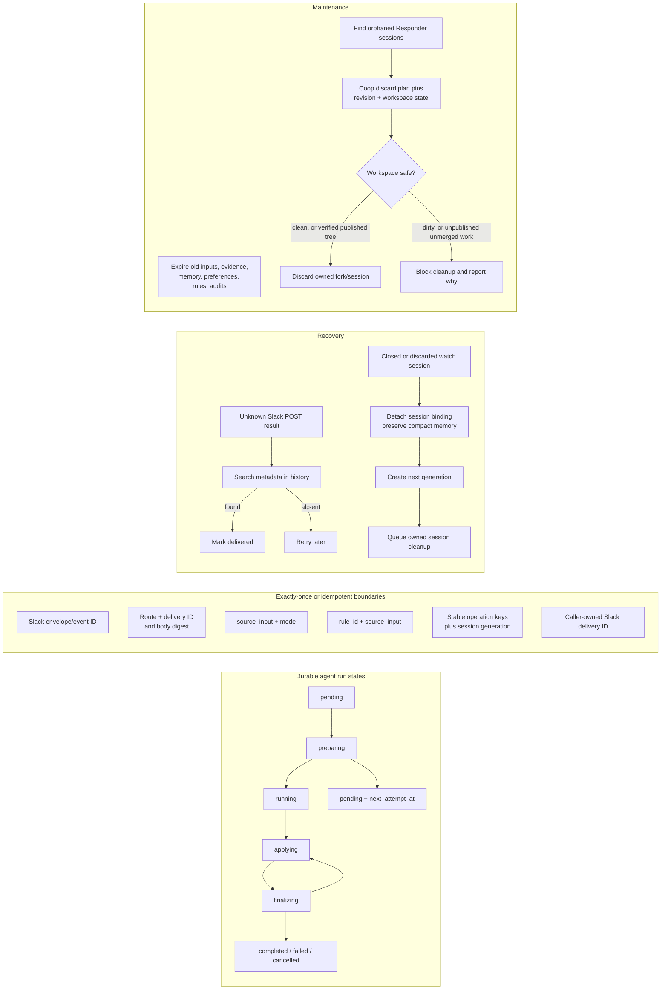

Key properties:

- SQLite uses WAL mode, full synchronous writes, and one connection.
- One durable scheduling index stores only work identity, lane, conversation key, priority, due
  time, retry state, and lease token. Domain payloads remain in typed tables.
- Expired scheduler leases are reclaimed during normal operation. Lease-token checks stop a stale
  worker from completing work reclaimed by another worker.
- Slack inputs are leased in timestamp order within a channel, but only an actively processing
  input holds that channel. Once it queues an agent run, it is complete and cannot exhaust retries
  while the model works.
- The control lane prioritizes slash commands and buttons; long Coop work runs independently in the
  background lane.
- A short settle delay lets nearby messages enter the context snapshot before submission. Responder
  reads channel history around the target or paginates an old thread, merges it with already
  admitted inputs, excludes unrelated threads, guarantees the root and target are present, and
  persists the resulting ordered snapshot on the run for exact restart reuse.
- After the first summarized turn in a conversation, the stored last-message timestamp becomes the
  Slack history cursor. Later turns load only the delta plus the compact summary.
- A delayed older event cannot reply after a newer channel decision has completed.
- Coop create results are refreshed through `GET` because an idempotent create replay describes the
  original creation state, not necessarily the current session state.
- Replacement watch sessions use generation-aware create and run keys.
- Posts, updates, and statuses use one durable, coalescing Slack delivery ledger. Ambiguous posts
  reconcile by metadata before retry; updates retry idempotently; per-thread status generations
  ensure an older progress write cannot supersede a newer clear.
- A terminal failed watch run queues a user-facing failure, clears pending status, detaches the
  session while preserving compact memory, and queues cleanup.
- Automatic cleanup operates only on exact Responder-owned session IDs. It never accepts dirty
  work, and it accepts unmerged work only after the exact reviewed tree has been durably published.
- Channel deletion removes conversation summaries, channel-scoped memory, preferences, and rules.
  Repository reconciliation removes orphaned repository-scoped state. Normal maintenance prunes raw
  operational data and compact conversation summaries on their separate schedules.

## 8. Main durable records

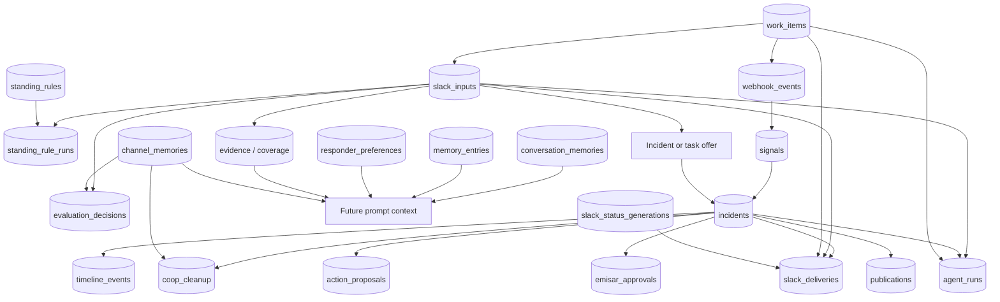

These are logical relationships. Not every arrow is a database foreign key; some are deliberately
bound by stable source IDs and idempotency keys so admission and recovery can remain independent.
